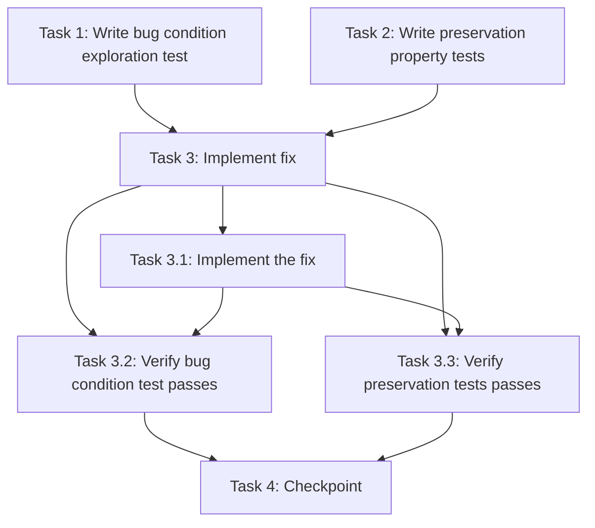

# Implementation Plan

## Overview

This implementation plan fixes the Bengali Unicode vowel sign and hasanta rendering bug in /no-marking mode using the bug condition methodology. The workflow follows an exploratory approach: first writing tests to understand the bug, then implementing the fix, and finally validating correctness and preservation.

## Tasks

- [ ] 1. Write bug condition exploration test
  - **Property 1: Bug Condition** - Bengali Unicode Vowel Sign and Hasanta Rendering
  - **CRITICAL**: This test MUST FAIL on unfixed code - failure confirms the bug exists
  - **DO NOT attempt to fix the test or the code when it fails**
  - **NOTE**: This test encodes the expected behavior - it will validate the fix when it passes after implementation
  - **GOAL**: Surface counterexamples that demonstrate the bug exists
  - **Scoped PBT Approach**: For deterministic bugs, scope the property to the concrete failing case(s) to ensure reproducibility
  - Test implementation details from Bug Condition in design:
    - Test inputs: Bengali Unicode text containing vowel signs (ি, া, ে, ো) and consonant sequences
    - Bug condition: `containsBengaliUnicode(input) AND (containsVowelSigns(input) OR containsConsonantsWithSpecificSequences(input))`
    - Concrete failing cases:
      - "বই" (should keep vowel sign with base consonant, not split into "ব্ই")
      - "এক" (should not insert spurious hasanta, not become "্এক")
      - "একটি ভালো বই পড়া মানে অন্য এক জগতে প্রবেশ করা।" (full sentence with multiple vowel signs)
  - The test assertions should match the Expected Behavior Properties from design:
    - `vowelSignsAttachedCorrectly(graphemes)` - vowel signs remain in correct position with base consonants
    - `noSpuriousHasanta(graphemes)` - no hasanta (্) appears where not present in input
    - `displayRendersCorrectly(graphemes)` - final display matches expected output
  - Test the text processing pipeline:
    - Call `normalizeText(input, "bn", false)` from `lib/unicode/text-normalizer.js`
    - Call `splitBengaliGraphemes(normalizedText)` from `lib/unicode/grapheme-splitter.js`
    - Verify grapheme clusters keep vowel signs with their base consonants
    - Verify no spurious hasanta characters appear in output
  - Run test on UNFIXED code
  - **EXPECTED OUTCOME**: Test FAILS (this is correct - it proves the bug exists)
  - Document counterexamples found to understand root cause:
    - Which vowel signs are being split incorrectly?
    - Where are spurious hasanta characters being inserted?
    - Is the issue in `isBengaliCombiningMark`, `splitBengaliGraphemes`, or `normalizeText`?
  - Mark task complete when test is written, run, and failure is documented
  - _Requirements: 1.1, 1.2, 1.3_

- [ ] 2. Write preservation property tests (BEFORE implementing fix)
  - **Property 2: Preservation** - Non-Buggy Input Behavior
  - **IMPORTANT**: Follow observation-first methodology
  - Observe behavior on UNFIXED code for non-buggy inputs:
    - English text: "The quick brown fox" should normalize and split correctly
    - Bengali consonants only: "ক খ গ" should display correctly
    - Bengali conjuncts: "স্কুল", "ন্তু", "ক্ষ" should render conjuncts correctly
    - Bengali reph: "বর্তমান", "ধর্ম" should render reph correctly
    - Independent vowels: "আ", "ই", "উ", "এ", "ও" should display correctly
  - Write property-based tests capturing observed behavior patterns from Preservation Requirements:
    - For English text: `normalizeText(englishText, "en", false)` produces same output as before
    - For Bengali without vowel signs: grapheme splitting produces same clusters as before
    - For Bengali conjuncts with ZWJ: reph and conjunct formation remains unchanged
    - For all non-bug-condition inputs: `splitBengaliGraphemes` produces identical results
  - Property-based testing generates many test cases for stronger guarantees:
    - Generate random English strings and verify unchanged normalization
    - Generate random Bengali strings with conjuncts and verify preservation
    - Generate random strings without vowel signs and verify consistent behavior
  - Run tests on UNFIXED code
  - **EXPECTED OUTCOME**: Tests PASS (this confirms baseline behavior to preserve)
  - Mark task complete when tests are written, run, and passing on unfixed code
  - _Requirements: 3.1, 3.2, 3.3, 3.4, 3.5, 3.6_

- [ ] 3. Fix for Bengali Unicode vowel sign and hasanta rendering bug

  - [ ] 3.1 Implement the fix in text processing functions
    - **Primary File**: `lib/unicode/grapheme-splitter.js`
    - Review and correct `isBengaliCombiningMark` function:
      - Verify vowel sign code point ranges are complete and accurate (U+09BE-U+09C8, U+09CB-U+09CC)
      - Ensure independent vowels (U+0985-U+0994) are NOT treated as combining marks
      - Confirm hasanta (U+09CD) is correctly handled in conjunct context
    - Fix `splitBengaliGraphemes` function:
      - Review the while loop that collects combining marks after a base character
      - Ensure it correctly groups ALL vowel signs with their base consonant in a single cluster
      - Verify the loop doesn't terminate prematurely when encountering vowel signs
      - Ensure base character selection correctly identifies consonants vs independent vowels
      - Fix logic that causes spurious hasanta insertion
    - **Secondary File**: `lib/unicode/text-normalizer.js`
    - Review `normalizeText` function:
      - Verify ZWJ handling for Bengali text preserves reph and conjuncts
      - Confirm NFC normalization doesn't reorder vowel signs incorrectly
      - Ensure danda normalization doesn't interfere with vowel signs
    - **Tertiary File**: `lib/unicode/bengali-normalizer.js`
    - Review `normalizeUnicodeBengaliForComparison` function:
      - Verify comparison normalization preserves vowel sign integrity
      - Ensure reph normalization doesn't affect vowel signs
    - _Bug_Condition: `isBugCondition(input)` where `containsBengaliUnicode(input) AND (containsVowelSigns(input) OR containsConsonantsWithSpecificSequences(input))`_
    - _Expected_Behavior: `vowelSignsAttachedCorrectly(graphemes) AND noSpuriousHasanta(graphemes) AND displayRendersCorrectly(graphemes)` from design_
    - _Preservation: All English text, Bengali conjuncts, reph, independent vowels, timer/WPM/accuracy calculations must remain unchanged_
    - _Requirements: 1.1, 1.2, 1.3, 2.1, 2.2, 2.3, 3.1, 3.2, 3.3, 3.4, 3.5, 3.6_

  - [ ] 3.2 Verify bug condition exploration test now passes
    - **Property 1: Expected Behavior** - Bengali Unicode Vowel Sign and Hasanta Rendering
    - **IMPORTANT**: Re-run the SAME test from task 1 - do NOT write a new test
    - The test from task 1 encodes the expected behavior
    - When this test passes, it confirms the expected behavior is satisfied
    - Run bug condition exploration test from step 1:
      - Test "বই" now renders as "বই" (no hasanta, vowel sign correct)
      - Test "এক" now renders as "এক" (no spurious hasanta)
      - Test full sentence now renders correctly without position or hasanta errors
    - **EXPECTED OUTCOME**: Test PASSES (confirms bug is fixed)
    - _Requirements: 2.1, 2.2, 2.3_

  - [ ] 3.3 Verify preservation tests still pass
    - **Property 2: Preservation** - Non-Buggy Input Behavior
    - **IMPORTANT**: Re-run the SAME tests from task 2 - do NOT write new tests
    - Run preservation property tests from step 2:
      - Verify English text normalization unchanged
      - Verify Bengali conjuncts still render correctly
      - Verify reph still renders correctly
      - Verify independent vowels still display correctly
      - Verify timer, WPM, and accuracy calculations unchanged
    - **EXPECTED OUTCOME**: Tests PASS (confirms no regressions)
    - Confirm all tests still pass after fix (no regressions)
    - _Requirements: 3.1, 3.2, 3.3, 3.4, 3.5, 3.6_

- [ ] 4. Checkpoint - Ensure all tests pass
  - Run all tests from tasks 1-3
  - Verify bug condition test passes (bug is fixed)
  - Verify preservation tests pass (no regressions)
  - Test the fix manually in /no-marking mode:
    - Type Bengali Unicode text with vowel signs
    - Verify correct display without position errors
    - Verify no spurious hasanta characters appear
    - Switch between English and Bengali to verify preservation
  - Ensure all tests pass, ask the user if questions arise

## Task Dependency Graph



```json
{
  "waves": [
    {
      "waveName": "Exploration",
      "tasks": ["1", "2"]
    },
    {
      "waveName": "Implementation",
      "tasks": ["3.1"]
    },
    {
      "waveName": "Validation",
      "tasks": ["3.2", "3.3"]
    },
    {
      "waveName": "Checkpoint",
      "tasks": ["4"]
    }
  ]
}
```

## Notes

- Tasks 1 and 2 MUST be completed BEFORE Task 3 (implementation)
- Task 1 test is EXPECTED to FAIL on unfixed code - this confirms the bug exists
- Task 2 tests are EXPECTED to PASS on unfixed code - this establishes the preservation baseline
- Task 3.2 and 3.3 rerun the SAME tests from Tasks 1 and 2 - do NOT write new tests
- The bug condition methodology ensures we understand the bug before fixing it
- Property-based testing is used for preservation to provide stronger guarantees
